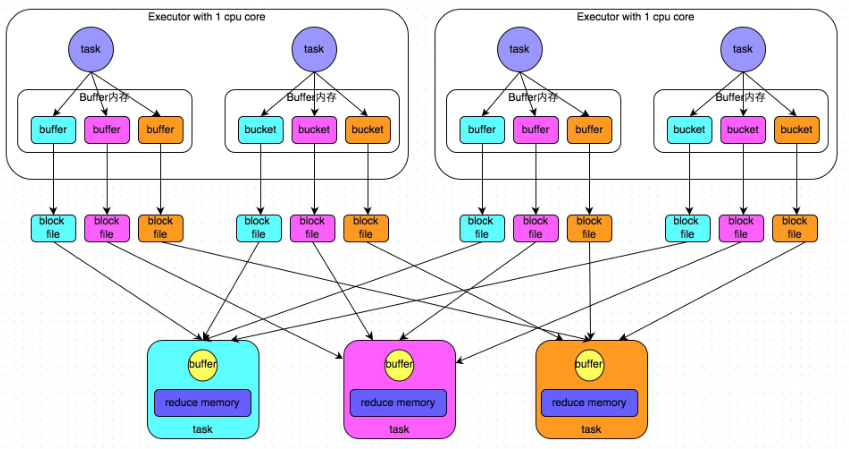
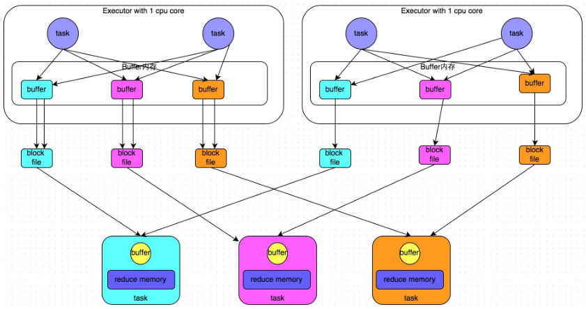
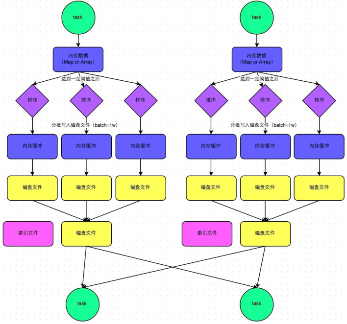
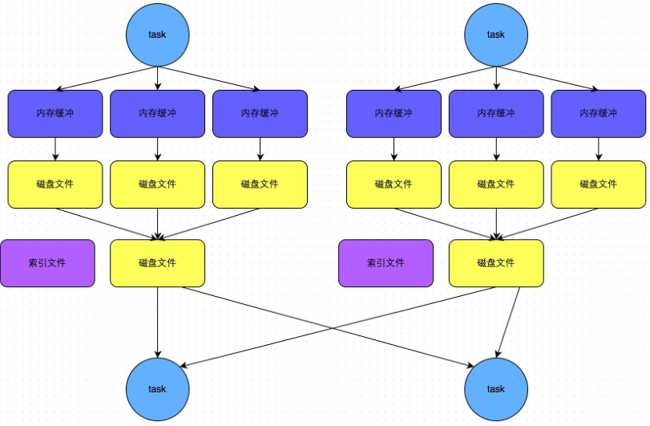
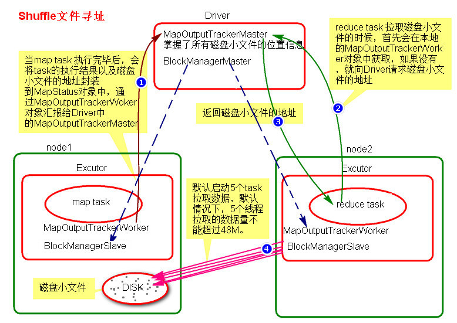
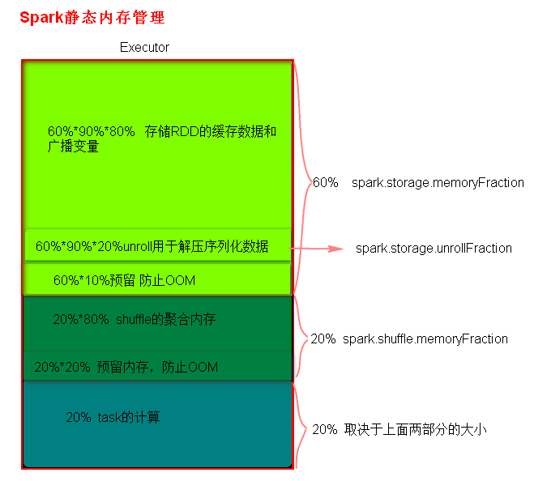
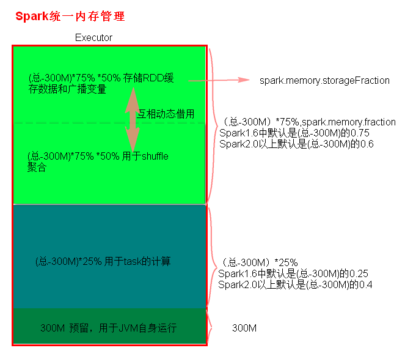

## **SparkShuffle**

### 1.  SparkShuffle概念

reduceByKey会将上一个RDD中的每一个key对应的所有value聚合成一个value，然后生成一个新的RDD，元素类型是<key,value>对的形式，这样每一个key对应一个聚合起来的value。

**问题：**聚合之前，每一个key对应的value不一定都是在一个partition中，也不太可能在同一个节点上，因为RDD是分布式的弹性的数据集，RDD的partition极有可能分布在各个节点上。

**如何聚合？**

**– Shuffle Write：**上一个stage的每个map task就必须保证将自己处理的当前分区的数据相同的key写入一个分区文件中，可能会写入多个不同的分区文件中。

 **– Shuffle Read：**reduce task就会从上一个stage的所有task所在的机器上寻找属于己的那些分区文件，这样就可以保证每一个key所对应的value都会汇聚到同一个节点上去处理和聚合。

Spark中有两种Shuffle管理类型，HashShufflManager和SortShuffleManager，Spark1.2之前是HashShuffleManager， Spark1.2引入SortShuffleManager,在Spark 2.0+版本中已经将HashShuffleManager丢弃。

### 2.HashShuffleManager

1) 普通机制

Ø 普通机制示意图

 

Ø 执行流程

 a) 每一个map task将不同结果写到不同的buffer中，每个buffer的大小为32K。buffer起到数据缓存的作用。

 b) 每个buffer文件最后对应一个磁盘小文件。

 c) reduce task来拉取对应的磁盘小文件。

Ø 总结

① .map task的计算结果会根据分区器（默认是hashPartitioner）来决定写入到哪一个磁盘小文件中去。ReduceTask会去Map端拉取相应的磁盘小文件。

② .产生的磁盘小文件的个数：

M（map task的个数）*R（reduce task的个数）

Ø 存在的问题

产生的磁盘小文件过多，会导致以下问题：

a) 在Shuffle Write过程中会产生很多写磁盘小文件的对象。

b) 在Shuffle Read过程中会产生很多读取磁盘小文件的对象。

c) 在JVM堆内存中对象过多会造成频繁的gc,gc还无法解决运行所需要的内存 的话，就会OOM。

d) 在数据传输过程中会有频繁的网络通信，频繁的网络通信出现通信故障的可能性大大增加，一旦网络通信出现了故障会导致shuffle file cannot find 由于这个错误导致的task失败，TaskScheduler不负责重试，由DAGScheduler负责重试Stage。

2) 合并机制

Ø 合并机制示意图

 

Ø 总结

产生磁盘小文件的个数：C(core的个数)*R（reduce的个数）

### 3. SortShuffleManager

1) 普通机制

Ø 普通机制示意图

 

Ø 执行流程

a) map task 的计算结果会写入到一个内存数据结构里面，内存数据结构默认是5M

b) 在shuffle的时候会有一个定时器，不定期的去估算这个内存结构的大小，当内存结构中的数据超过5M时，比如现在内存结构中的数据为5.01M，那么他会申请5.01*2-5=5.02M内存给内存数据结构。

c) 如果申请成功不会进行溢写，如果申请不成功，这时候会发生溢写磁盘。

d) 在溢写之前内存结构中的数据会进行排序分区

e) 然后开始溢写磁盘，写磁盘是以batch的形式去写，一个batch是1万条数据，

f) map task执行完成后，会将这些磁盘小文件合并成一个大的磁盘文件，同时生成一个索引文件。

g) reduce task去map端拉取数据的时候，首先解析索引文件，根据索引文件再去拉取对应的数据。

Ø 总结

产生磁盘小文件的个数： 2*M（map task的个数）

2) bypass机制

Ø bypass机制示意图

 

Ø 总结

① .bypass运行机制的触发条件如下：

shuffle reduce task的数量小于spark.shuffle.sort.bypassMergeThreshold的参数值。这个值默认是200。

② .产生的磁盘小文件为：2*M（map task的个数）

### 4. Shuffle文件寻址

1) MapOutputTracker

MapOutputTracker是Spark架构中的一个模块，是一个主从架构。管理磁盘小文件的地址。

Ø MapOutputTrackerMaster是主对象，存在于Driver中。

Ø MapOutputTrackerWorker是从对象，存在于Excutor中。

2) BlockManager

BlockManager块管理者，是Spark架构中的一个模块，也是一个主从架构。

Ø BlockManagerMaster,主对象，存在于Driver中。

BlockManagerMaster会在集群中有用到广播变量和缓存数据或者删除缓存数据的时候，通知BlockManagerSlave传输或者删除数据。

Ø BlockManagerSlave，从对象，存在于Excutor中。

BlockManagerSlave会与BlockManagerSlave之间通信。

¬ 无论在Driver端的BlockManager还是在Excutor端的BlockManager都含有三个对象：

① DiskStore:负责磁盘的管理。

② MemoryStore：负责内存的管理。

③ BlockTransferService:负责数据的传输。

3) Shuffle文件寻址图

 

4) Shuffle文件寻址流程

a) 当map task执行完成后，会将task的执行情况和磁盘小文件的地址封装到MpStatus对象中，通过MapOutputTrackerWorker对象向Driver中的MapOutputTrackerMaster汇报。

b) 在所有的map task执行完毕后，Driver中就掌握了所有的磁盘小文件的地址。

c) 在reduce task执行之前，会通过Excutor中MapOutPutTrackerWorker向Driver端的MapOutputTrackerMaster获取磁盘小文件的地址。

d) 获取到磁盘小文件的地址后，会通过BlockManager连接数据所在节点，然后通过BlockTransferService进行数据的传输。

e) BlockTransferService默认启动5个task去节点拉取数据。默认情况下，5个task拉取数据量不能超过48M。

### **5. Spark内存管理**

Spark执行应用程序时，Spark集群会启动Driver和Executor两种JVM进程，Driver负责创建SparkContext上下文，提交任务，task的分发等。Executor负责task的计算任务，并将结果返回给Driver。同时需要为需要持久化的RDD提供储存。Driver端的内存管理比较简单，这里所说的Spark内存管理针对Executor端的内存管理。

Spark内存管理分为静态内存管理和统一内存管理，Spark1.6之前使用的是静态内存管理，Spark1.6之后引入了统一内存管理。

**静态内存管理**中存储内存、执行内存和其他内存的大小在 Spark 应用程序运行期间均为固定的，但用户可以应用程序启动前进行配置。

**统一内存管理**与静态内存管理的区别在于储存内存和执行内存共享同一块空间，可以互相借用对方的空间。

Spark1.6以上版本默认使用的是统一内存管理，可以通过参数spark.memory.useLegacyMode 设置为true(默认为false)使用静态内存管理。

####  5.1 静态内存管理分布图

 

#### 5.2 统一内存管理分布图

  

#### 5.3. reduce 中OOM如何处理？

1) 减少每次拉取的数据量

2) 提高shuffle聚合的内存比例

3) 提高Excutor的总内存

### 6. Shuffle调优

SparkShuffle调优配置项如何使用？

1) 在代码中,不推荐使用，硬编码。

new SparkConf().set(“spark.shuffle.file.buffer”,”64”)

2) 在提交spark任务的时候，推荐使用。

spark-submit --conf spark.shuffle.file.buffer=64 –conf ….

3) 在conf下的spark-default.conf配置文件中,不推荐，因为是写死后所有应用程序都要用。

`spark.shuffle.file.buffer`
默认值：32k
参数说明：该参数用于设置shuffle write task的BufferedOutputStream的buffer缓冲大小。将数据写到磁盘文件之前，会先写入buffer缓冲中，待缓冲写满之后，才会溢写到磁盘。
调优建议：如果作业可用的内存资源较为充足的话，可以适当增加这个参数的大小（比如64k），从而减少shuffle write过程中溢写磁盘文件的次数，也就可以减少磁盘IO次数，进而提升性能。在实践中发现，合理调节该参数，性能会有1%~5%的提升。

`spark.reducer.maxSizeInFlight`
默认值：48m
参数说明：该参数用于设置shuffle read task的buffer缓冲大小，而这个buffer缓冲决定了每次能够拉取多少数据。
调优建议：如果作业可用的内存资源较为充足的话，可以适当增加这个参数的大小（比如96m），从而减少拉取数据的次数，也就可以减少网络传输的次数，进而提升性能。在实践中发现，合理调节该参数，性能会有1%~5%的提升。

`spark.shuffle.io.maxRetries`
默认值：3
参数说明：shuffle read task从shuffle write task所在节点拉取属于自己的数据时，如果因为网络异常导致拉取失败，是会自动进行重试的。该参数就代表了可以重试的最大次数。如果在指定次数之内拉取还是没有成功，就可能会导致作业执行失败。
调优建议：对于那些包含了特别耗时的shuffle操作的作业，建议增加重试最大次数（比如60次），以避免由于JVM的full gc或者网络不稳定等因素导致的数据拉取失败。在实践中发现，对于针对超大数据量（数十亿~上百亿）的shuffle过程，调节该参数可以大幅度提升稳定性。
shuffle file not find    taskScheduler不负责重试task，由DAGScheduler负责重试stage

`spark.shuffle.io.retryWait`
默认值：5s
参数说明：具体解释同上，该参数代表了每次重试拉取数据的等待间隔，默认是5s。
调优建议：建议加大间隔时长（比如60s），以增加shuffle操作的稳定性。

`spark.shuffle.memoryFraction`
默认值：0.2
参数说明：该参数代表了Executor内存中，分配给shuffle read task进行聚合操作的内存比例，默认是20%。
调优建议：在资源参数调优中讲解过这个参数。如果内存充足，而且很少使用持久化操作，建议调高这个比例，给shuffle read的聚合操作更多内存，以避免由于内存不足导致聚合过程中频繁读写磁盘。在实践中发现，合理调节该参数可以将性能提升10%左右。

`spark.shuffle.manager`
默认值：sort|hash
参数说明：该参数用于设置ShuffleManager的类型。Spark 1.5以后，有三个可选项：hash、sort和tungsten-sort。HashShuffleManager是Spark 1.2以前的默认选项，但是Spark 1.2以及之后的版本默认都是SortShuffleManager了。tungsten-sort与sort类似，但是使用了tungsten计划中的堆外内存管理机制，内存使用效率更高。
调优建议：由于SortShuffleManager默认会对数据进行排序，因此如果你的业务逻辑中需要该排序机制的话，则使用默认的SortShuffleManager就可以；而如果你的业务逻辑不需要对数据进行排序，那么建议参考后面的几个参数调优，通过bypass机制或优化的HashShuffleManager来避免排序操作，同时提供较好的磁盘读写性能。这里要注意的是，tungsten-sort要慎用，因为之前发现了一些相应的bug。

`spark.shuffle.sort.bypassMergeThreshold`
默认值：200
参数说明：当ShuffleManager为SortShuffleManager时，如果shuffle read task的数量小于这个阈值（默认是200），则shuffle write过程中不会进行排序操作，而是直接按照未经优化的HashShuffleManager的方式去写数据，但是最后会将每个task产生的所有临时磁盘文件都合并成一个文件，并会创建单独的索引文件。
调优建议：当你使用SortShuffleManager时，如果的确不需要排序操作，那么建议将这个参数调大一些，大于shuffle read task的数量。那么此时就会自动启用bypass机制，map-side就不会进行排序了，减少了排序的性能开销。但是这种方式下，依然会产生大量的磁盘文件，因此shuffle write性能有待提高。

`spark.shuffle.consolidateFiles`
默认值：false
参数说明：如果使用HashShuffleManager，该参数有效。如果设置为true，那么就会开启consolidate机制，会大幅度合并shuffle write的输出文件，对于shuffle read task数量特别多的情况下，这种方法可以极大地减少磁盘IO开销，提升性能。
调优建议：如果的确不需要SortShuffleManager的排序机制，那么除了使用bypass机制，还可以尝试将spark.shffle.manager参数手动指定为hash，使用HashShuffleManager，同时开启consolidate机制。在实践中尝试过，发现其性能比开启了bypass机制的SortShuffleManager要高出10%~30%。